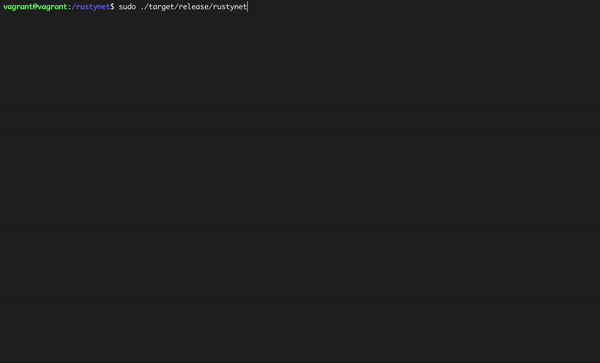

# RustyNet: Network Emulation over Cloud Docker Containers

Author: Guanzhou Hu @ MIT
Date: Oct 6, 2019


## Overview

**RustyNet** is a network emulator over Docker containers written in Rust. It is motivated by these two network emulators:

- [Mininet](http://mininet.org/): a great SDN emulator, but only supports process-level isolation and cannot scale beyond a single host.
- [Yans](https://github.com/kennethjiang/YANS): a very basic prototype of doing network emulation over Docker containers in Python.

**RustyNet's main goals** lie in the following three aspects:

1. Verify the feasibility of using the [*Rust*](https://www.rust-lang.org/) language to conduct network experiments.
2. Verify the feasibility of doing network emulation over [*Docker containers*](https://www.docker.com/).
3. (future) Scale such kind of emulation onto large-scale cloud containers orchestration platforms (e.g., [*Kubernetes*](https://kubernetes.io/)), and explore the advantages and drawbacks of doing it this way.

**Demonstration** of how RustyNet works:




## Installation

RustyNet requires the following prerequisites:

- [*Rust*](https://www.rust-lang.org/) toolchain - lastest stable version
- (optional in the future) *Vagrant* & *VirtualBox*
- (currently not needed) *Google Cloud CLI* & *Kubernetes* access

RustyNet only supports execution on Linux and OS X platforms. Clone this repo and you are ready to use it.


## Usage

The following is a temporary usage guide based on local Vagrant environment. RustyNet's ultimate goal is to deploy such emulation onto cloud Docker containers in the future.

### Preparations

Under the project folder, do the following:

```Bash
# Bring the Vagrant VM up from the provided Vagrantfile
$ vagrant up
$ vagrant ssh

# Go into synced working directory.
$ cd /rustynet

# Compile in 'release' mode.
$ cargo build --release

# Build the Docker image for RustyNet nodes, from the provided Dockerfile.
$ cd docker-env
$ sudo docker build -t rustynet/node .
$ cd ..
```

### Run RustyNet

Initial topology is generated from a YAML config file `<topo-name>.yml`. Put it under `topolib/` folder. (Currently this prototype always used the `minimal.yml` example topology.)

Run RustyNet **in root user privilege**:
```Bash
$ sudo ./target/release/rustynet
```

Using RustyNet CLI runs in basically three phases:

1. Docker containers & networks will be created based on the specification in the given topology config file.
2. Then, you will enter the **RustNet Shell**, where you can do interactively manage your network components, and do experiments among them, e.g.,
    - `RustyNet> docker ps`: show all living nodes;
    - `RustyNet> h1 ping h2`: commands starting with a node's name will *automatically*exit be interpreted as `docker exec -it [CMD]`, i.e., runs within that node's shell;
3. Cleaning up phase.


## TODO List

- [x] ~~Prototyping on local Docker containers~~
- [ ] Tweak resource & bandwidth limits in Docker
- [ ] Publish the Docker image online & doing pull instead of real-time build
- [ ] Verify the effect of using host bridges as links
- [ ] Better way of emulating "routers" using containers
- [ ] More example topologies
- [ ] Taking in command line arguments to set logging level / clean
- [ ] Scale it up onto cloud platforms
